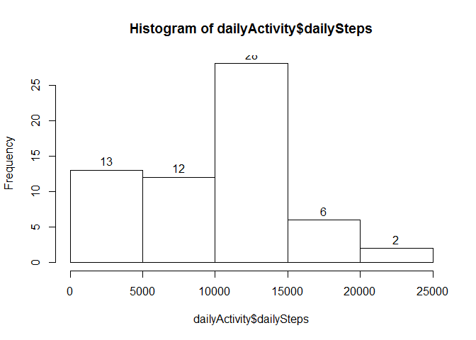
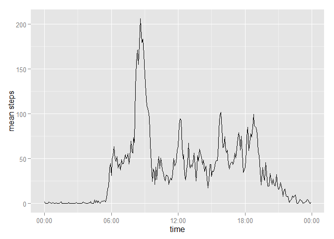
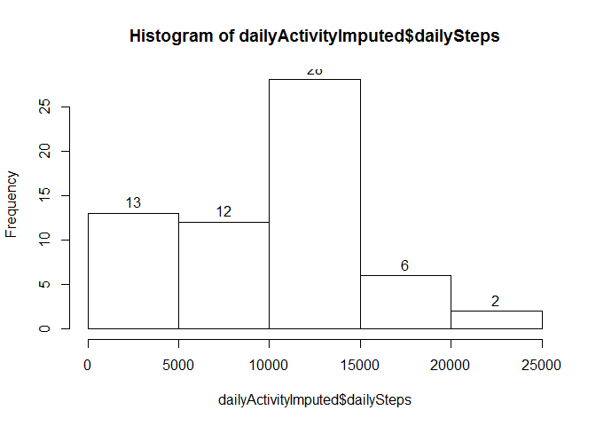
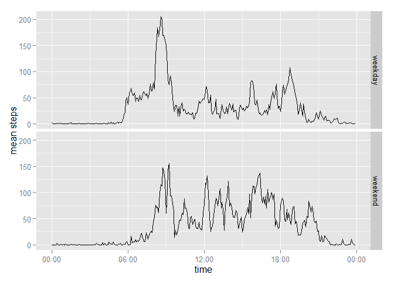

# Reproducible Research: Peer Assessment 1


## Loading and preprocessing the data
Load data from `activity.csv` - if not present in working directory, unzip `activity.zip`. If neither are present or unzipping fails, throw an error.

```r
if (!file.exists('activity.csv')) {
    # CSV is not in the working directory - unzip if possible
    if (!file.exists('activity.zip')) {
        # neither CSV nor ZIP are in the working directory
        errmsg <- paste('activity file was not found in',getwd())
        stop(errmsg)
    }
    # unzip activity.csv from activity.zip
    filesUnzipped <- unzip('activity.zip')
    if (!'./activity.csv' %in% filesUnzipped) {
        errmsg <- paste(
            file.path(getwd(),'activity.zip'),
            'did not contain activity.csv or something went wrong unzipping.\n',
            'Check the zip, and try unzipping manually before trying again'
            )
        stop(errmsg)
    }
    rm(filesUnzipped)
}
activity <- read.csv('activity.csv',stringsAsFactors=FALSE)
```

Preprocess by converting string dates and integer times to POSIXct dates and datetimes. Additional columns are calculated for weekday and hour. This step requires the [Lubridate][Lubridate] and [dplyr][dplyr] packages. If not present, install using `install.packages()`. Lubridate requires R Version >= 3.0.0 and dplyr requires R version >= 3.1.2 - This document was knitted using R version 3.2.1 (2015-06-18).

```r
suppressPackageStartupMessages(
    if (!require(lubridate) || !require(dplyr)){
        stop('Lubridate or dplyr package is not installed')
    }
)

activity$datetime <- ymd_hm(paste(activity$date,
    formatC(activity$interval, width=4, flag='0', format='d')
    ))
activity$date <- ymd(activity$date)
activity$day <- wday(activity$datetime, label = TRUE)
activity$weekday <- 'weekday'
activity$weekday[activity$day == 'Sun' | activity$day == 'Sat'] <- 'weekend'

activity$weekday <- as.factor(activity$weekday)
activity$time <- hours(activity$interval%/%100) + minutes(activity$interval %% 100)
```


## What is mean total number of steps taken per day?

```r
dailyActivity <- activity %>% 
    group_by(date) %>% 
    summarise(dailySteps = sum(steps, na.rm=TRUE))

summary(dailyActivity)
```

```
##       date              dailySteps   
##  Min.   :2012-10-01   Min.   :    0  
##  1st Qu.:2012-10-16   1st Qu.: 6778  
##  Median :2012-10-31   Median :10395  
##  Mean   :2012-10-31   Mean   : 9354  
##  3rd Qu.:2012-11-15   3rd Qu.:12811  
##  Max.   :2012-11-30   Max.   :21194
```


```r
hist(dailyActivity$dailySteps, labels=TRUE)
```

 


```r
mean(dailyActivity$dailySteps,na.rm=TRUE)
```

```
## [1] 9354.23
```

```r
median(dailyActivity$dailySteps,na.rm=TRUE)
```

```
## [1] 10395
```


## What is the average daily activity pattern?

```r
timeActivity <- activity %>% 
    group_by(interval) %>%
    summarise(
        meanSteps = mean(steps, na.rm = TRUE),
        medianSteps = median(steps, na.rm = TRUE)
        )
timeActivity$time <- hours(timeActivity$interval%/%100) + minutes(timeActivity$interval %% 100)
```
The following code uses the `ggplot2` and `scales` packages to plot the timeseries. `scales` is used to get access to the `scale_x_datetime` function used to format the time axis appropriately.

```r
require(ggplot2)
```

```
## Loading required package: ggplot2
```

```r
require(scales)
```

```
## Loading required package: scales
```

```r
qplot(x=ymd('20121001')+time, y=meanSteps, data=timeActivity,geom='line',xlab='time',ylab='mean steps') + scale_x_datetime(labels=date_format('%H:%M'))
```

 


```r
timeActivity[which.max(timeActivity$meanSteps),'time']
```

```
## Source: local data frame [1 x 1]
## 
##        time
## 1 8H 35M 0S
```


## Imputing missing values

Total missing

```r
sum(is.na(activity$steps))
```

```
## [1] 2304
```
Total days entirely missing (ie. all intervals contain NA)

```r
activity %>% 
    group_by(date) %>% 
    summarise(missing=sum(is.na(steps)), intervals=n()) %>%
    filter(missing>0) %>% 
    arrange(desc(missing))
```

```
## Source: local data frame [8 x 3]
## 
##         date missing intervals
## 1 2012-10-01     288       288
## 2 2012-10-08     288       288
## 3 2012-11-01     288       288
## 4 2012-11-04     288       288
## 5 2012-11-09     288       288
## 6 2012-11-10     288       288
## 7 2012-11-14     288       288
## 8 2012-11-30     288       288
```
There are 8 days which have no steps recorded, and there are no days which are partially missing.
So replacing `NA` with mean/median for that day will not work. Using the median for the time interval instead. May be useful to combine with day of week later on.

```r
activityImputed <- activity
for (i in timeActivity$interval){
    # TODO: replace this with sapply/lapply - or use a join from dplyr (or data.table)
    replacement <- round(unlist(timeActivity[timeActivity$interval==i, 'medianSteps']))
    activityImputed[is.na(activityImputed$steps) & activityImputed$interval == i,]$steps <- replacement
}
dailyActivityImputed <- activityImputed %>% 
    group_by(date) %>% 
    summarise(dailySteps = sum(steps))

summary(dailyActivityImputed)
```

```
##       date              dailySteps   
##  Min.   :2012-10-01   Min.   :   41  
##  1st Qu.:2012-10-16   1st Qu.: 6778  
##  Median :2012-10-31   Median :10395  
##  Mean   :2012-10-31   Mean   : 9504  
##  3rd Qu.:2012-11-15   3rd Qu.:12811  
##  Max.   :2012-11-30   Max.   :21194
```


```r
hist(dailyActivityImputed$dailySteps, labels=TRUE)
```

 


```r
mean(dailyActivityImputed$dailySteps,na.rm=TRUE)
```

```
## [1] 9503.869
```

```r
median(dailyActivityImputed$dailySteps,na.rm=TRUE)
```

```
## [1] 10395
```


## Are there differences in activity patterns between weekdays and weekends?


```r
timeActivityImputed <- activityImputed %>% 
    group_by(weekday,interval) %>%
    summarise(
        meanSteps = mean(steps, na.rm = TRUE),
        medianSteps = median(steps, na.rm = TRUE)
        )

timeActivityImputed$time <- 
    hours(timeActivityImputed$interval%/%100) + 
    minutes(timeActivityImputed$interval %% 100)


qplot(x=ymd('20121001')+time, y=meanSteps, data=timeActivityImputed,geom='line',xlab='time',ylab='mean steps',facets=weekday ~ .) + scale_x_datetime(labels=date_format('%H:%M'))
```

 

[Lubridate]: https://cran.r-project.org/package=lubridate "Lubridate package at CRAN"
[dplyr]: https://cran.r-project.org/package=dplyr "dplyr package at CRAN"
