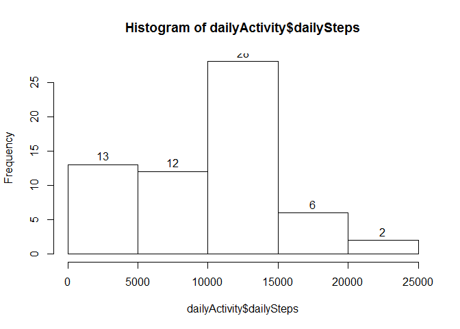

# Reproducible Research: Peer Assessment 1


## Loading and preprocessing the data
Load data from `activity.csv` - if not present in working directory, unzip `activity.zip`. If neither are present or unzipping fails, throw an error.

```r
if (!file.exists('activity.csv')) {
    # CSV is not in the working directory - unzip if possible
    if (!file.exists('activity.zip')) {
        # neither CSV nor ZIP are in the working directory
        errmsg <- paste('activity file was not found in',getwd())
        stop(errmsg)
    }
    # unzip activity.csv from activity.zip
    filesUnzipped <- unzip('activity.zip')
    if (!'./activity.csv' %in% filesUnzipped) {
        errmsg <- paste(
            file.path(getwd(),'activity.zip'),
            'did not contain activity.csv or something went wrong unzipping.\n',
            'Check the zip, and try unzipping manually before trying again'
            )
        stop(errmsg)
    }
    rm(filesUnzipped)
}
activity <- read.csv('activity.csv',stringsAsFactors=FALSE)
```

Preprocess by converting string dates and integer times to POSIXct dates and datetimes. Additional columns are calculated for weekday and hour. This step requires the [Lubridate][Lubridate] and [dplyr][dplyr] packages. If not present, install using `install.packages()`. Lubridate requires R Version >= 3.0.0 and dplyr requires R version >= 3.1.2 - This document was knitted using R version 3.2.1 (2015-06-18).

```r
if (!require(lubridate) || !require(dplyr)) {
    stop('Lubridate or dplyr package is not installed')
}
```

```
## Loading required package: lubridate
## Loading required package: dplyr
## 
## Attaching package: 'dplyr'
## 
## The following objects are masked from 'package:lubridate':
## 
##     intersect, setdiff, union
## 
## The following objects are masked from 'package:stats':
## 
##     filter, lag
## 
## The following objects are masked from 'package:base':
## 
##     intersect, setdiff, setequal, union
```

```r
activity$datetime <- ymd_hm(paste(activity$date,
    formatC(activity$interval, width=4, flag='0', format='d')
    ))
activity$date <- ymd(activity$date)
activity$weekday <- wday(activity$datetime, label = TRUE)
activity$time <- hours(activity$interval%/%100) + minutes(activity$interval %% 100)
```


## What is mean total number of steps taken per day?

```r
dailyActivity <- activity %>% 
    group_by(date) %>% 
    summarise(dailySteps = sum(steps, na.rm=TRUE))

hist(dailyActivity$dailySteps, labels=TRUE)
```

 


## What is the average daily activity pattern?

```r
timeActivity <- activity %>% 
    group_by(interval) %>%
    summarise(
        meanSteps = mean(steps, na.rm = TRUE),
        medianSteps = median(steps, na.rm = TRUE)
        )
```


## Imputing missing values


## Are there differences in activity patterns between weekdays and weekends?


## References
1. [Lubridate][Lubridate] 
[Lubridate]: https://cran.r-project.org/package=lubridate "Lubridate package at CRAN"
